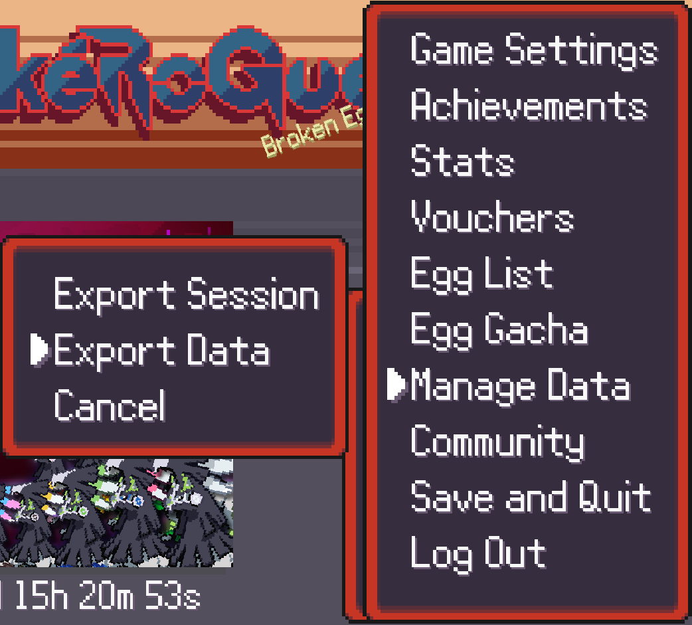

IronRogue is a fork of the original PokéRogue fangame which aims to provide the tools required to more easily automate the process of running PokéRogue IronMon. The original IronRogue rules can be found at https://github.com/Reimittv/IronRogue/tree/main.

## Warnings
Although every effort is made to ensure this fork honours changes made to the original <strong>Running this fork may lead to unexpected corruption of your PokéRogue data,</strong> as such it is recommended that you run it within an incognito session that is not logged into your main account. If you wish to load your PokéRogue into IronRogue this can be done by first exporting your data to <picture></picture> a .prsv file and importing this back into IronRogue.

<picture></picture>

PokéRogue is a browser based Pokémon fangame heavily inspired by the roguelite genre. Battle endlessly while gathering stacking items, exploring many different biomes, fighting trainers, bosses, and more! 

# Contributing
## 🛠️ Development
If you have the motivation and experience with Typescript/Javascript (or are willing to learn) please feel free to fork the repository and make pull requests with contributions. If you don't know what to work on but want to help, reference the below **To-Do** section or the **#feature-vote** channel in the discord. 

### 💻 Environment Setup
#### Prerequisites
- node: 20.13.1
- npm: [how to install](https://docs.npmjs.com/downloading-and-installing-node-js-and-npm#using-a-node-version-manager-to-install-nodejs-and-npm)

#### Running Locally
1. Clone the repo and in the root directory run `npm install`
    - *if you run into any errors, reach out in the **#dev-corner** channel in discord*
    - Occasionally new packages/libraries are added to the dependencies. If you see errors following an update try running 'npm install'.
2. Run `npm run start:dev` to locally run the project in `localhost:8000`

#### Linting
We're using ESLint as our common linter and formatter. It will run automatically during the pre-commit hook but if you would like to manually run it, use the `npm run eslint` script. 

### ❔ FAQ 

**How do I test a new _______?**
- In the `src/overrides.ts` file there are overrides for most values you'll need to change for testing

## 🪧 To Do
Check out [Github Issues](https://github.com/pagefaultgames/pokerogue/issues) to see how can you help us!

# 📝 Credits
> If this project contains assets you have produced and you do not see your name here, **please** reach out.

### 🎵 BGM
  - Pokémon Mystery Dungeon: Explorers of Sky
    - Arata Iiyoshi
    - Hideki Sakamoto
    - Keisuke Ito
    - Ken-ichi Saito
    - Yoshihiro Maeda
  - Pokémon Black/White
    - Go Ichinose
    - Hitomi Sato
    - Shota Kageyama
  - Pokémon Mystery Dungeon: Rescue Team DX
    - Keisuke Ito
    - Arata Iiyoshi
    - Atsuhiro Ishizuna
  - Pokémon HeartGold/SoulSilver
  - Pokémon Black/White 2
  - Pokémon X/Y
  - Pokémon Omega Ruby/Alpha Sapphire
  - Pokémon Sun/Moon
  - Pokémon Ultra Sun/Ultra Moon
  - Pokémon Sword/Shield
  - Pokémon Scarlet/Violet
  - Firel (Custom Metropolis and Laboratory biome music)
  - Lmz (Custom Jungle biome music)

### 🎵 Sound Effects
  - Pokémon Emerald
  - Pokémon Black/White

### 🎨 Backgrounds
  - Squip (Paid Commissions)
  - Contributions by Someonealive-QN

### 🎨 UI
  - GAMEFREAK
  - LJ Birdman

### 🎨 Pagefault Games Intro
  - Spectremint

### 🎨 Game Logo
  - Gonstar (Paid Commission)

### 🎨 Trainer Sprites
  - GAMEFREAK (Pokémon Black/White 2, Pokémon Diamond/Pearl)
  - kyledove
  - Brumirage
  - pkmn_realidea (Paid Commissions)

### 🎨 Trainer Portraits
  - pkmn_realidea (Paid Commissions)

### 🎨 Pokemon Sprites and Animation
  - GAMEFREAK (Pokémon Black/White 2)
  - Smogon Sprite Project (Various Artists)
  - Skyflyer
  - Nolo33
  - Ebaru
  - EricLostie
  - KingOfThe-X-Roads
  - kiriaura
  - Caruban
  - Sopita_Yorita
  - Azrita
  - AshnixsLaw
  - Hellfire0raptor
  - RetroNC
  - Franark122k
  - OldSoulja
  - PKMarioG
  - ItsYugen
  - lucasomi
  - Pkm Sinfonia
  - Poki Papillon
  - Fleimer_
  - bizcoeindoloro
  - mangalos810
  - Involuntary-Twitch
  - selstar

### 🎨 Move Animations
  - Pokémon Reborn
